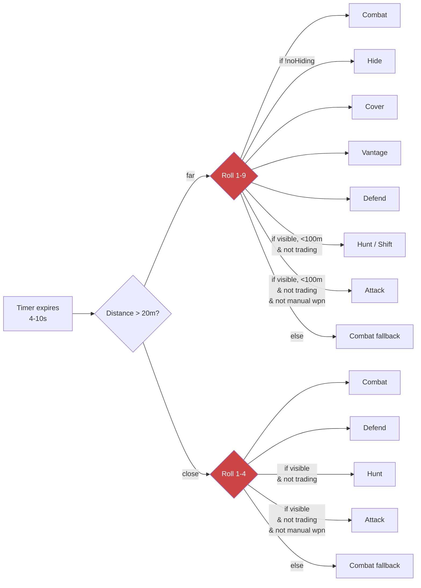
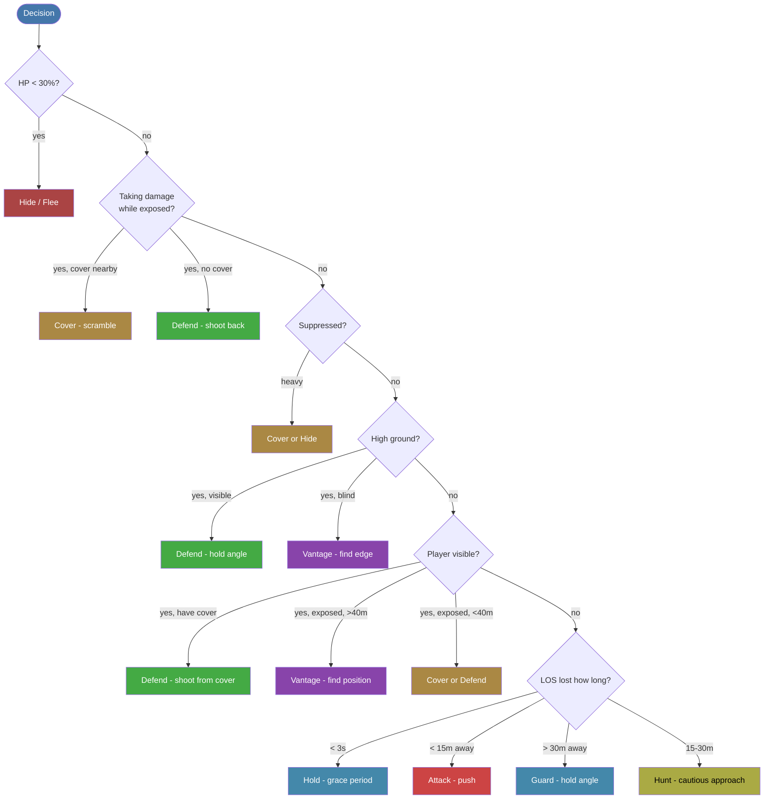
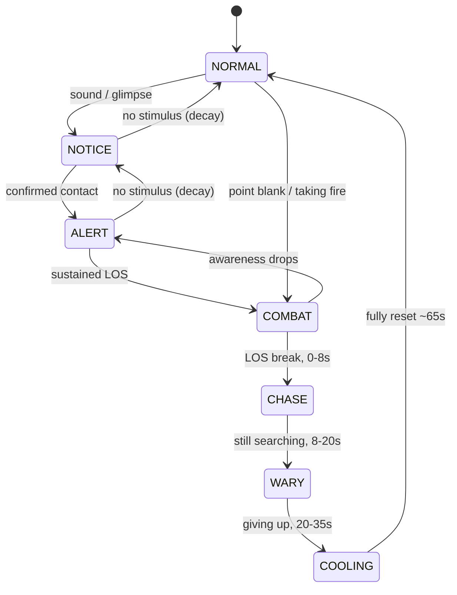
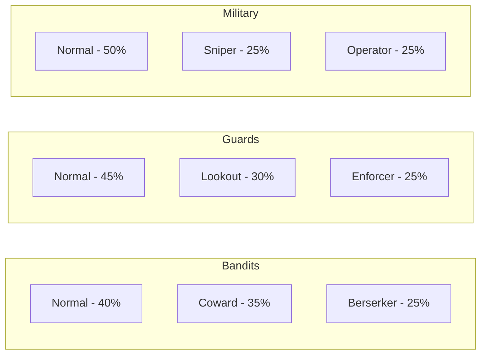

# Archetype AI

AI overhaul for Road to Vostok. Built for the community modloader.

## The Problem

Vanilla AI has a state machine with some conditions, but the conditions are shallow and the selection within each bracket is random with roughly equal weights.

There's a distance bracket and a visibility gate on the aggressive options, so it's not pure random. But within each bracket the roll is flat, every valid option has equal chance. Nothing considers cover, health, suppression, elevation, or what the AI was already doing. It can roll Hide in the middle of a firefight or stand in the open when cover is right there.

## What This Mod Does

Replaces the dice rolls with a condition tree. Instead of picking a random state the AI checks what's actually happening and picks the one right answer.

### Decision Tree

Every branch has one answer for one reason. Personality shifts the thresholds (berserkers skip the flee check, cowards flee earlier, snipers always prefer vantage) but the structure is the same.

If there's no cover nearby the AI won't waste time looking for some. It stays where it is and fights. No more running in circles in an open field.

### Awareness

Vanilla detection is binary, you're either spotted or you aren't. This mod replaces it with a 0-1 float that ramps up over time. Took a lot from how MGSV handles its alert system.

Visibility reads the actual sky shader, fog density, and overcast from the game engine. Night and fog tank detection range. Sound depends on surface type (metal is 1.7x louder than dirt), weather, and what the player is doing. Crouching on grass at 50m? They won't hear you. Sprinting on metal in a quiet building? They know exactly where you are.

### Personalities

Every AI gets a personality when it spawns. These aren't just accuracy tweaks, they change how the AI actually plays.

| Archetype | Sees player | Loses LOS | Key trait |
|-----------|------------|-----------|-----------|
| **Coward** | Same as Normal | Guard (won't push) | Flees at 40% HP |
| **Berserker** | Shift >30m, Defend <30m | Attack (sprints to you) | Never flees, charges when hit |
| **Sniper** | Cover <15m, Defend >15m | Vantage (new position) | Relocates after 3-5 shots |
| **Operator** | Shift >40m, Defend <40m | Shift >30m, Hunt <30m | Pushes through low suppression |
| **Enforcer** | Defend (always) | Guard (always) | Never advances, never retreats |
| **Lookout** | Cover <20m, Defend >20m | Guard (won't push) | 1.5x awareness gain speed |
| **Normal** | Defend if covered, else Cover/Vantage | Attack <15m, Guard >30m, Hunt mid | Balanced, cover-aware |

### Combat Memory

Vanilla forgets you in seconds. This mod keeps combat memory for over a minute. When you break LOS the AI extrapolates your movement direction and tries to cut you off (took this from FEAR's approach to position evaluation). 30% of the time they guess wrong so it doesn't feel like wallhacks.

Personality matters here too. Berserkers sprint to your last position. Cowards hold where they are. Normal AI cautiously hunts. Search uses existing map waypoints biased in your movement direction.

### Other Stuff

**Suppression** - bullets passing near AI build suppression pressure (point-to-line math, no physics queries). Pinned AI lose accuracy and seek cover, heavy suppression causes panic.

**Alert propagation** - one AI entering combat boosts nearby AI to alert, not combat. They investigate on their own instead of everyone dogpiling you. 40-50m range, military gets a stronger awareness boost than bandits.

**First-shot near-miss** - first round after detection misses close on purpose. Gives you that half-second of "where was that" before the shooting starts. Took this from how Halo handles first contact.

**Boss phases** - Punisher bosses go from tactical to calling reinforcements to full desperation rush as they take damage.

**Spawn pacing** - tension tracker pauses spawning during fights, gives you a breather after. Based on L4D's Director concept.

**Weapon limits** - shotguns drop off past 15m, pistols past 25m, rifles past 80m. Moving AI shoots worse. No more shotgun snipers.

**Weather visibility** - detection range scales with sky shader lighting, fog, overcast, TOD, posture, flashlight.

**Surface hearing** - metal 1.7x, wood 1.35x, wind reduces hearing 0.7x, crouch-walking is nearly silent.

**Performance LOD** - distant AI skip expensive raycasts. Still wander and animate, just not burning CPU at 200m+.

## Install

Drop `VostokAIOverhaul/` (the folder with mod.txt in it) into your mods directory, launch the game.

**ImmersiveXP**: Not compatible, both mods override AI.gd. Disable IXP.
**Faction Warfare**: Compatible.
**MCM**: Key settings configurable in-game.

## Debug

Turn on Debug Mode in MCM. F8-F11 for spawn/godmode/heal. Awareness labels show up above AI heads with state, awareness %, and personality.

## Credits

Took a lot of ideas from FEAR, MGSV, L4D, the LAMBS Danger mod for ARMA, and Tarkov/Hunt for the boss and faction stuff. SPT Questing Bots for spawn pacing ideas.

## License

MIT
